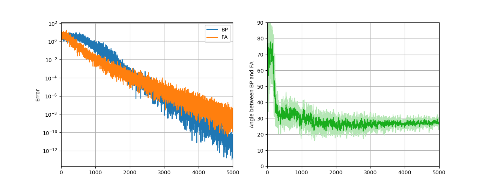

# [RE]-Random-synaptic-feedback-weights-support-error-backpropagation-for-deep-learning

This repo is to replicate (partially) the result of T. P. Lillicrap, D. Cownden, D. B. Tweed, and C. J. Akerman, “Random synaptic feedback weights support error backpropagation for deep learning,” Nature Communications, vol. 7, pp. 1–10, 1AD.

`re1.py` is for the simple linear network.

`re2.py` is for the nolinear network on MNIST dataset.

Result in `figs/e1.png` mathes with the that in the paper very well; Performance of `figs/e2.png` matches well, whereas the angle are not so proper when compared with the paper.